# TechStore - Sistema de Gestión de Inventario

Laboratorio 08 - Desarrollo de Soluciones en la Nube (Tecsup).

Aplicación web para gestionar el inventario de una cadena de tiendas, con registro e inicio de
sesión, token JWT, bloqueo por intentos fallidos, login con Google y GitHub, y autenticación
multi-factor (TOTP) con Google Authenticator.

## Tecnologías

- Node.js + Express
- MongoDB + Mongoose
- EJS + Materialize
- jsonwebtoken, bcrypt, otplib, qrcode

## Requisitos

- Node.js 18 o superior
- MongoDB corriendo en local (o una URI de MongoDB Atlas)

## Instalación

```bash
npm install
cp .env.example .env
```

Completar el archivo `.env`:

| Variable | Descripción |
| --- | --- |
| `MONGODB_URI` | Cadena de conexión a MongoDB |
| `JWT_SECRET` | Secreto para firmar los tokens |
| `MFA_ENC_KEY` | Clave para cifrar el secreto TOTP en la base de datos |
| `SEED_PASSWORD` | Password de los usuarios de prueba |
| `GOOGLE_CLIENT_ID`, `GOOGLE_CLIENT_SECRET` | Credenciales OAuth de Google |
| `GITHUB_CLIENT_ID`, `GITHUB_CLIENT_SECRET` | Credenciales OAuth de GitHub |

`JWT_SECRET` y `MFA_ENC_KEY` se generan con:

```bash
node -e "console.log(require('crypto').randomBytes(32).toString('hex'))"
```

### Credenciales de Google

1. Entrar a https://console.cloud.google.com/apis/credentials
2. Crear credenciales > ID de cliente de OAuth > Aplicación web.
3. URI de redireccionamiento autorizado: `http://localhost:3000/api/auth/google/callback`
4. Copiar el Client ID y el Client Secret al `.env`.

### Credenciales de GitHub

1. Entrar a https://github.com/settings/developers > New OAuth App.
2. Homepage URL: `http://localhost:3000`
3. Authorization callback URL: `http://localhost:3000/api/auth/github/callback`
4. Copiar el Client ID y generar un Client Secret, luego pegarlos en el `.env`.

Si no se configuran, el resto de la aplicación funciona igual y los botones de login social
muestran un aviso.

## Ejecución

```bash
npm run dev     # desarrollo (nodemon)
npm start       # producción
```

Abrir http://localhost:3000

La primera vez que arranca se cargan tiendas, productos y un usuario por perfil:

| Email | Perfil | Tienda |
| --- | --- | --- |
| admin@techstore.com | Administrador del Sistema | Todas |
| gerente@techstore.com | Gerente de Tienda | TechStore Lima Centro |
| empleado@techstore.com | Empleado de Ventas | TechStore Lima Centro |
| auditor@techstore.com | Auditor | Todas |

El password de todos es el valor de `SEED_PASSWORD`.

## Flujo de autenticación

1. El usuario ingresa email y password (o entra con Google / GitHub).
2. Si las credenciales son correctas, el sistema crea un desafío MFA y entrega un ticket temporal
   de 5 minutos. Ese ticket no sirve para consumir la API.
3. En el primer ingreso se muestra un código QR para vincular Google Authenticator.
4. El usuario ingresa el código de 6 dígitos (cambia cada 30 segundos).
5. Si es correcto se entrega el token JWT completo. Si falla 3 veces debe iniciar sesión otra vez.

Después de 5 intentos fallidos (passwords o códigos MFA incorrectos) la cuenta se bloquea 15
minutos. El contador se reinicia al completar el segundo factor. El administrador puede
desbloquearla desde la pantalla de usuarios.

## Permisos por perfil

| Acción | Administrador | Gerente | Empleado | Auditor |
| --- | --- | --- | --- | --- |
| Consultar productos | Sí | Su tienda | Sí | Sí |
| Crear / editar productos | Sí | Su tienda | No | No |
| Actualizar stock | Sí | Su tienda | Su tienda | No |
| Eliminar productos | Sí | Su tienda | No | No |
| Reportes | Sí | Su tienda | No | Sí |
| Ver usuarios | Sí | No | No | Solo lectura |
| Gestionar usuarios y roles | Sí | No | No | No |

## Endpoints

| Método | Ruta | Descripción |
| --- | --- | --- |
| POST | `/api/auth/signUp` | Registro |
| POST | `/api/auth/signIn` | Valida credenciales y abre el desafío MFA |
| POST | `/api/auth/mfa/setup` | Genera el secreto TOTP y el QR |
| POST | `/api/auth/mfa/verify` | Valida el código y entrega el JWT |
| GET | `/api/auth/google`, `/api/auth/github` | Login social |
| GET | `/api/users/me` | Datos del usuario autenticado |
| GET | `/api/users` | Listado de usuarios |
| PUT | `/api/users/:id` | Cambiar rol y tienda |
| POST | `/api/users/:id/unlock` | Desbloquear cuenta |
| POST | `/api/users/:id/reset-mfa` | Reiniciar MFA |
| GET | `/api/products` | Listado de productos |
| GET | `/api/products/report` | Reporte por tienda |
| POST | `/api/products` | Crear producto |
| PUT | `/api/products/:id` | Editar producto |
| PATCH | `/api/products/:id/stock` | Actualizar stock |
| DELETE | `/api/products/:id` | Eliminar producto |
| GET | `/api/stores` | Listado de tiendas |
| POST | `/api/stores` | Crear tienda |

## Estructura

```
src/
  controllers/   Entrada HTTP
  services/      Lógica de negocio (auth, OAuth, productos, usuarios)
  models/        Esquemas de Mongoose
  middlewares/   authenticate (JWT) y authorize (roles)
  routes/        Rutas de la API y de las vistas
  utils/         Cifrado, validaciones y datos iniciales
  views/         Plantillas EJS
  public/        CSS y JavaScript del navegador
```

## Evidencias

### Registro rechazado por contraseña débil

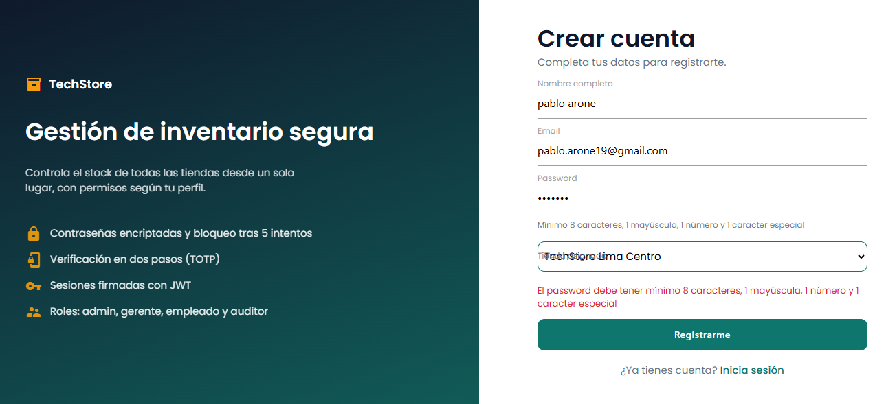

### QR del MFA y acceso concedido

En el primer ingreso se muestra el código QR para vincular Google Authenticator.

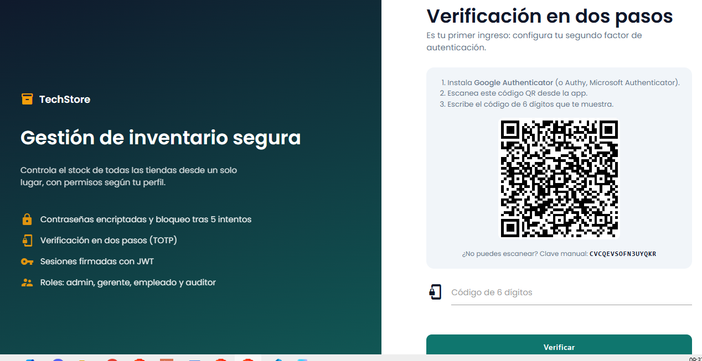

Con el código de 6 dígitos correcto se concede el acceso.

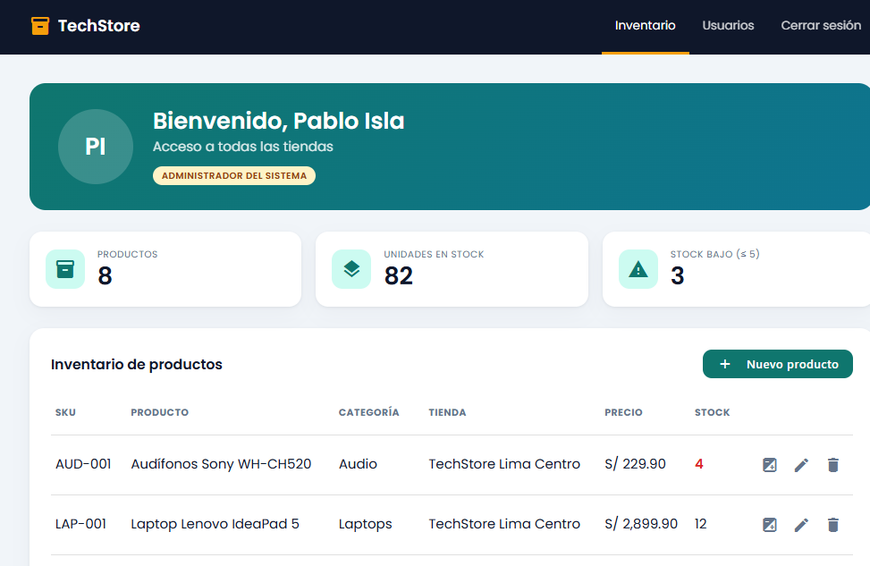

### JWT en jwt.io

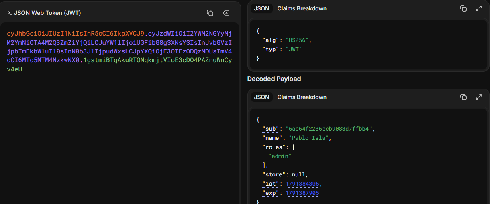

### MFA bloqueado tras 3 códigos incorrectos

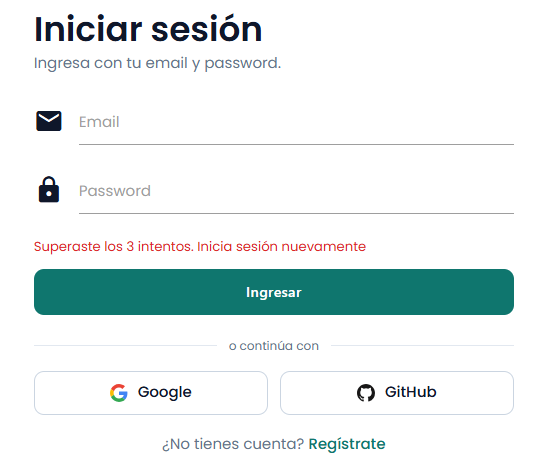

### Empleado intentando cambiar un precio

El Empleado de Ventas no tiene la opción de editar el producto: solo puede actualizar el stock de
su tienda.

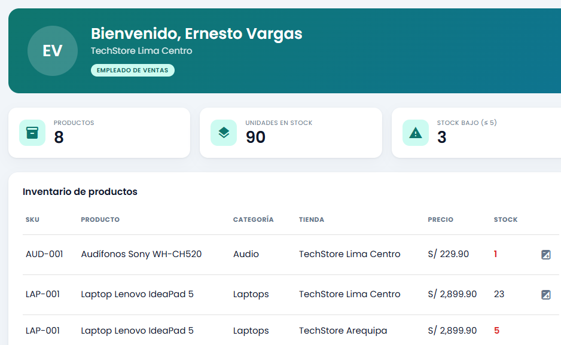

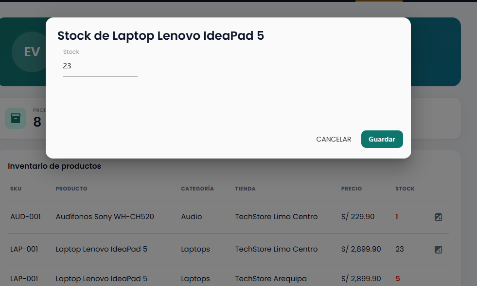

### Cuenta bloqueada tras 5 intentos

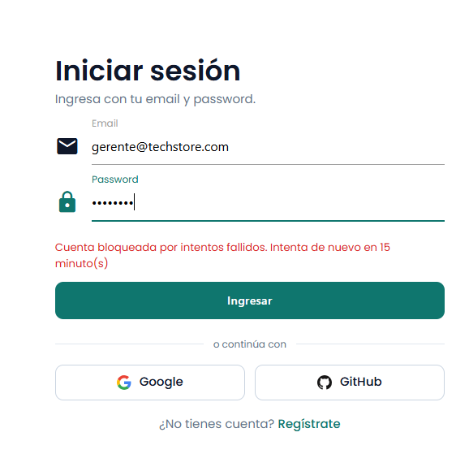

### Login con Google

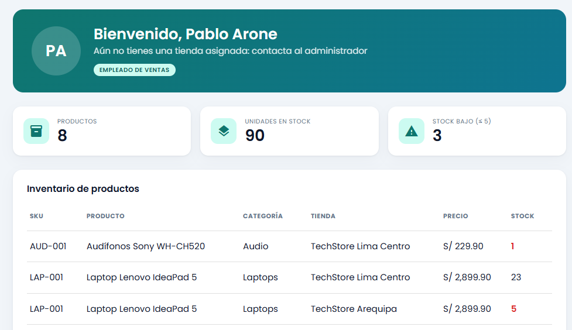

### Login con GitHub

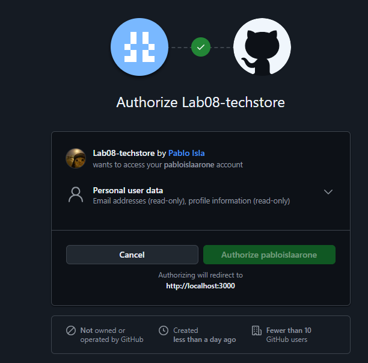

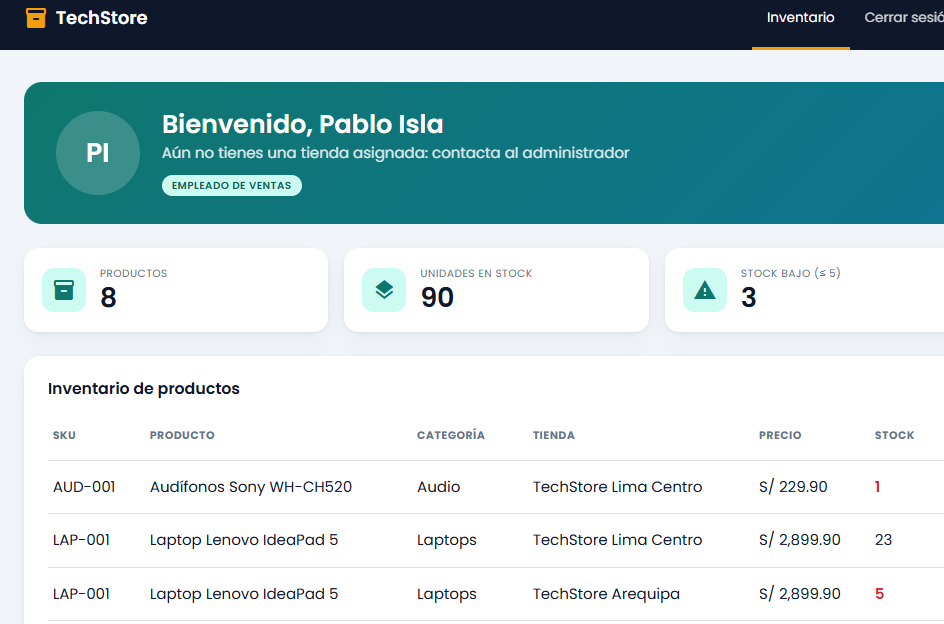

## Autor

Pablo Isla
